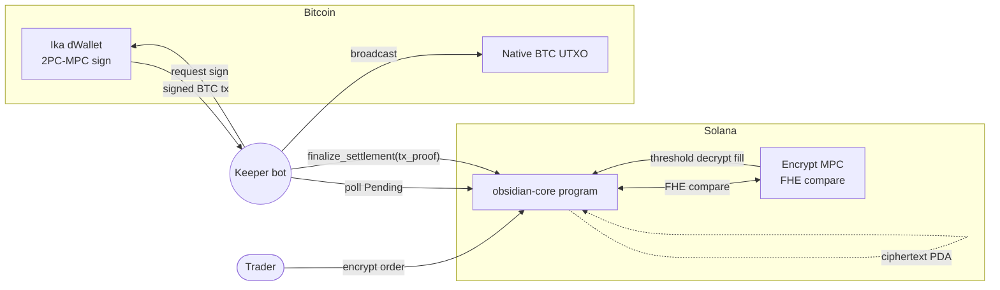

# ObsidianDesk

> The dark pool where Bitcoin never leaves Bitcoin.

Institutional dark-pool DEX on Solana for BTC / USDC.
Encrypted orderbook (FHE, [Encrypt](https://docs.encrypt.xyz)) + native BTC settlement ([Ika](https://docs.ika.xyz) dWallets). No bridges. No wrapped BTC. No plaintext orderbook.

[](https://github.com/mihailShumilov/obsidian-desk/actions/workflows/ci.yml)
[](LICENSE)
[](#whats-deployed-where)

**Devnet program:** `H25yY5o4emorZ9qMHAUvJhdtrFjDSeYy2MVYurpQbeLp`
**Demo URL:** _to be added after Vercel deploy — see [`docs/DEPLOYMENT.md`](docs/DEPLOYMENT.md)_

## Table of contents

1. [The problem](#the-problem)
2. [Why Ika *and* Encrypt](#why-ika-and-encrypt)
3. [Architecture](#architecture)
4. [Run via Docker (recommended)](#run-via-docker-recommended)
5. [Run locally without Docker](#run-locally-without-docker)
6. [Tests](#tests)
7. [Demo flow](#demo-flow)
8. [Repository layout](#repository-layout)
9. [Environment variables](#environment-variables)
10. [Troubleshooting](#troubleshooting)
11. [P-prompt progress](#p-prompt-progress)
12. [Known gaps](#known-gaps)
13. [License](#license)

## The problem

Every crypto dark pool today breaks on one of three axes:

1. **Orders leak.** Every L2 orderbook is a strategy leak. Validators, indexers, MEV searchers — they all see your price, size, and timing. The market front-runs you before you fill.
2. **Bridges break.** Wrapped BTC depends on a custodian or a cross-chain proof you can't audit. Every bridge is a single point of catastrophic failure.
3. **Custodians control.** If a venue holds your keys, it holds your fate. Withdrawal pauses, frozen assets, KYC creep — all downstream of custody.

ObsidianDesk picks the two technologies that fix all three: FHE for the orderbook, and native MPC signing for settlement.

**Target users**

- **Institutional OTC desks** moving >$500K at a time who can't broadcast their intent.
- **Bitcoin-native funds** that refuse to touch wrapped BTC for policy reasons.
- **Self-custodial traders** willing to trade a small latency premium for strategy privacy.

## Why Ika *and* Encrypt

Neither alone is enough — and each collapses the other's threat model when removed:

| Remove … | What happens | Resulting product |
|---|---|---|
| **Encrypt** | The orderbook becomes plaintext on chain. Watchers replay strategies in real time. | A Solana DEX with a public book. Uniswap already exists. |
| **Ika** | BTC must be wrapped, bridged, or escrowed. Custodian + trust assumptions come back. | A synthetic-BTC venue. wBTC already exists. |

The combination is where the differentiator lives: **private book + native settlement**.

## Architecture



See [`docs/ARCHITECTURE.md`](docs/ARCHITECTURE.md) for the full design and [`docs/UI_DESIGN.md`](docs/UI_DESIGN.md) for the design system.

**Stack**

| Layer | Tech |
|---|---|
| Solana program | Rust 1.93 + Anchor 0.32.1 (`programs/obsidian-core`) |
| Shared SDK | TypeScript 5.9 (`sdk/`) — adapters for Encrypt + Ika + bitcoinjs-lib |
| Frontend | Next.js 16.2 App Router + React 18.3 + Tailwind 3.4 (`app/`) |
| Keeper bot | Node.js 24 daemon (`keeper/`) |
| Bitcoin | signet via mempool.space esplora |
| Tooling | pnpm 9 workspaces, Solana CLI (Agave), Anchor |

## Run via Docker (recommended)

Prereqs: Docker Desktop ≥ 4.25 with Compose v2, ≥ 8 GB free RAM, the Solana CLI for the host validator (Agave's container is amd64-only, so on M-series Macs we run the validator on the host — see [troubleshooting](#docker-compose-up-fails-or-validator-doesnt-start)).

```bash
git clone https://github.com/mihailShumilov/obsidian-desk.git
cd obsidian-desk

# 1. host validator (M-series Macs MUST run this on host; x86 can opt into the
#    in-container validator with `docker compose --profile local-rpc up`)
solana-test-validator --rpc-port 18899 --bind-address 127.0.0.1 --reset

# 2. anchor build so target/idl/obsidian_core.json exists for the keeper mount
anchor build && anchor deploy --provider.cluster http://127.0.0.1:18899

# 3. one-shot bootstrap — generates a keeper keypair if missing,
#    builds + ups the stack, waits for healthchecks
pnpm docker:up
```

After ~30 s:

- App: <http://127.0.0.1:13000>
- Trade terminal: <http://127.0.0.1:13000/trade>
- Trade w/ admin tools: <http://127.0.0.1:13000/trade?admin=1>
- Keeper status JSON: <http://127.0.0.1:13001/status>
- Solana RPC: <http://127.0.0.1:18899>

Seed a demo (one-command bootstrap of market + 2 dWallets + 8 encrypted orders):

```bash
pnpm seed:demo
```

Tear down (removes containers + volumes):

```bash
pnpm docker:down
```

<details>
<summary><strong>Production overlay (pulls images from GHCR, no local validator)</strong></summary>

```bash
cp .env.example .env.production
# edit .env.production:
#   NEXT_PUBLIC_SOLANA_RPC=https://api.devnet.solana.com
#   SOLANA_RPC=https://api.devnet.solana.com
#   IMAGE_TAG=v0.1.0
#   KEEPER_KEYPAIR_PATH=/path/to/keeper-keypair.json
docker compose -f docker-compose.yml -f docker-compose.prod.yml \
  --env-file .env.production up -d
```

Image sizes: `obsidian-app` ≈ 313 MB (Next standalone, three.js dynamically loaded), `obsidian-keeper` ≈ 924 MB (`@coral-xyz/anchor` deps).

Full deployment runbook (rollback, monitoring, security checklist, cost estimates): [`docs/DEPLOYMENT.md`](docs/DEPLOYMENT.md).
</details>

## Run locally without Docker

For hot-reload iteration on a single service.

**Prereqs:** Node.js 24+, pnpm 9.15.4, Rust 1.93 stable, Solana CLI (Agave), Anchor 0.32.1.

```bash
# Install + emit SDK types so workspace deps resolve
pnpm install
pnpm -F @obsidian-desk/sdk build
pnpm typecheck

# In separate terminals:
solana-test-validator --rpc-port 18899 --bind-address 127.0.0.1 --reset
anchor build && anchor deploy --provider.cluster http://127.0.0.1:18899
pnpm dev   # boots app on :13000 + keeper on :13001 in parallel
```

Or open them one-by-one:

```bash
pnpm -F @obsidian-desk/app    dev   # frontend, hot reload
pnpm -F @obsidian-desk/keeper dev   # keeper, ts-node-dev watch
```

Common workspace commands:

| Command | What it does |
|---|---|
| `pnpm typecheck` | recursive `tsc --noEmit` across `sdk/`, `keeper/`, `app/` |
| `pnpm build` | recursive `pnpm build` (sdk → app → keeper) |
| `pnpm test` | recursive `pnpm test` (currently only `sdk/`) |
| `pnpm test:sdk` | 26 SDK unit tests, ~120 ms, no network |
| `pnpm anchor:build` | build the Solana program |
| `pnpm anchor:test` | full anchor + e2e suite (5 tests, ~11 s; needs validator) |
| `pnpm cargo:clippy` | clippy with `-D warnings` |
| `pnpm seed:demo` | bootstrap a fresh market + dWallets + 8 orders |
| `pnpm docker:up` / `pnpm docker:down` | full-stack docker convenience wrappers |

Detailed per-workspace debugging tips: [`docs/DEVELOPMENT.md`](docs/DEVELOPMENT.md).

## Tests

```bash
# SDK unit tests (26 tests, ~120 ms, zero network)
pnpm -F @obsidian-desk/sdk test

# Anchor + e2e (requires a running validator; anchor build first)
anchor test --skip-local-validator
#   ├─ obsidian-core.ts         — program unit tests
#   ├─ e2e-submit.ts            — encrypt → submit → byte-equality
#   ├─ e2e-settlement.ts        — one-leg mock settlement (P4)
#   └─ e2e-full.ts              — two-leg Alice/Bob settlement (P9)
```

CI runs the same TypeScript + Anchor checks against every push to `main` — see [`.github/workflows/ci.yml`](.github/workflows/ci.yml) and the badge above.

## Demo flow

1. **Onboard:** visit `/deposit`, click _Generate dWallet_ → step 2 shows a signet address + QR. Fund it, wait for the 15 s esplora poll, then _Lock_ to ObsidianDesk.
2. **Seal:** visit `/trade`, type a price + size, click _Encrypt & Seal_ → watch the 1.8 s choreography (button progress bar → scramble → envelope collapse → shoot-up → toast).
3. **Match:** click _Try Match_ in the header (or _Match all_ in `?admin=1`) → full match/settle modal plays: Beacon → Reveal counterparties → Settlement panels with Solana + Bitcoin progress → Sealed notification.
4. **Verify:** the `/positions` row flips to _Settled_; keeper logs `[keeper] settled match N at …`.

## Repository layout

```
programs/obsidian-core/   Anchor program (Rust)
sdk/                      Shared TS SDK (encrypt + ika + btc adapters)
app/                      Next.js 16.2 frontend
  app/                    routes: /, /trade, /deposit, /positions, /about, /kitchen, /api/health
  components/obsidian/    design-system primitives (Cipher, OrderbookVoid, …)
  components/landing/     BookCube 3D + landing sections
  components/trade/       PriceChart, OrderForm, YourOrders, MatchSettleModal
  components/deposit/     wizard (ProgressRail, StepShell, KeyShards, …)
  components/shell/       Header + Footer + DWalletChip + WalletButton
  stores/                 dWallet + order-state zustand stores
keeper/                   Matching + settlement keeper bot (daemon)
scripts/                  seed-demo, deploy/airdrop helpers, docker-bootstrap
tests/                    Integration + E2E tests (mocha + @coral-xyz/anchor)
docs/                     Authoritative project docs (6 files + DEVELOPMENT + DEPLOYMENT)
docs/vendor/              Vendored Encrypt + Ika SDK references
```

## Environment variables

Copy [`.env.example`](.env.example) — every variable with comments. Summary:

| Variable | Required | Default | Purpose | Used by |
|---|---|---|---|---|
| `NEXT_PUBLIC_SOLANA_RPC` | yes | `http://127.0.0.1:18899` | Browser-side Solana RPC URL (wallet adapter) | app |
| `ANCHOR_PROVIDER_URL` | yes (keeper / scripts) | `http://127.0.0.1:18899` | Server-side Solana RPC URL | keeper, anchor CLI |
| `ANCHOR_WALLET` | yes (keeper / scripts) | `~/.config/solana/id.json` | Keypair the keeper signs `finalize_settlement` with | keeper, anchor CLI |
| `SOLANA_RPC` | docker compose only | `http://solana-validator:8899` | Internal docker-network alias for the keeper to reach the validator | keeper container |
| `OBSIDIAN_PROGRAM_ID` / `NEXT_PUBLIC_OBSIDIAN_PROGRAM_ID` | yes | `H25y…beLp` (devnet) | Pinned program id; must match `Anchor.toml` + `declare_id!()` | app, keeper, scripts |
| `NEXT_PUBLIC_NETWORK` | no | `devnet` | Label rendered in the header chip | app |
| `OBSIDIAN_ESPLORA_URL` | no | `https://mempool.space/signet/api` | esplora-style API base for the deposit balance poll | app server actions |
| `OBSIDIAN_ENCRYPT_MODE` | no | `mock` | `mock` (default) or `real` (throws until upstream package compiles, gap E5) | sdk |
| `OBSIDIAN_IKA_MODE` | no | `mock` | Same pattern as Encrypt mode | sdk |
| `KEEPER_POLL_MS` | no | `3000` | Match-poll interval | keeper |
| `KEEPER_PORT` | no | `13001` (host) / `3001` (container) | `/status` endpoint port | keeper |
| `KEEPER_FEERATE` | no | `4` | BTC fee rate (sat/vB) for settlement txs | keeper |
| `KEEPER_DEBUG` | no | unset | Set to truthy to log mock-store contents on each tick | keeper |
| `KEEPER_KEYPAIR_PATH` | docker | `./scripts/.keeper-keypair.json` | Host path mounted to `/run/secrets/keeper_keypair.json` | docker compose |
| `IMAGE_TAG` | docker prod | `latest` | Tag for GHCR images in the prod overlay | docker compose prod |

## Troubleshooting

<details>
<summary><strong><code>TS2307: Cannot find module '@obsidian-desk/sdk'</code></strong></summary>

The TS workspaces are linked through `sdk/dist/` (built output, not source). Build the SDK once after a fresh clone:

```bash
pnpm -F @obsidian-desk/sdk build
```

CI does this in `.github/workflows/ci.yml` before the workspace-wide `typecheck`.
</details>

<details>
<summary><strong><code>docker compose up</code> fails or validator doesn't start</strong></summary>

The `solana-validator` service is **opt-in** via `--profile local-rpc`. By default `docker compose up` brings only `app` + `keeper`, expecting the validator to be running on the host (`solana-test-validator --rpc-port 18899 --bind-address 127.0.0.1`).

Why: Anza only publishes Agave for `linux/amd64`, and current Agave 3.x panics under qemu emulation on arm64 (`io_uring NOT supported`). On M-series Macs, run the validator on the host. On x86 Linux, opt in:

```bash
docker compose --profile local-rpc up -d
```
</details>

<details>
<summary><strong>Anchor test: <code>Blockhash not found</code> on every RPC call</strong></summary>

Anchor's default commitment is `processed`, which returns blockhashes the validator hasn't finalized. Build the provider explicitly:

```ts
const provider = new anchor.AnchorProvider(connection, wallet, {
  commitment: 'confirmed',
  preflightCommitment: 'confirmed',
});
```

The pattern is in every test file under `tests/`.
</details>

<details>
<summary><strong>Mocha hangs forever during anchor test</strong></summary>

Anchor's WebSocket event listeners hang against a manually-spawned validator. Don't use `program.addEventListener(...)` — instead, fetch the transaction and parse `Program data:` lines from `meta.logMessages`. See `tests/obsidian-core.ts` `eventsFor()` helper for the pattern.
</details>

<details>
<summary><strong><code>Failed to reallocate account data</code></strong></summary>

A ciphertext `Vec<u8>` exceeded `CT_MAX = 3000` bytes. Solana's CPI realloc cap is 10 240 B for the whole account; the three CT slots in `EncryptedOrder` plus the linked-list pointer share that budget. See gap E0 in [`docs/gaps.md`](docs/gaps.md).
</details>

<details>
<summary><strong>Docker build fails on <code>usb</code> / <code>node-gyp</code></strong></summary>

The umbrella `@solana/wallet-adapter-wallets` drags in hardware-wallet (Ledger / Trezor) native deps that need libusb + python at install time. We use the per-wallet packages instead (`@solana/wallet-adapter-phantom`); if you add another adapter, prefer the specific package over the umbrella.
</details>

<details>
<summary><strong>Hydration mismatch in app/ for a persisted-store-backed component</strong></summary>

The persisted zustand store hydrates client-side only. Render a skeleton on first paint, set state in a `useEffect`, only render the real markup after hydration. Pattern: `app/components/shell/dwallet-chip.tsx`.
</details>

<details>
<summary><strong>Real-mode <code>VendorSDKUnavailableError</code></strong></summary>

The upstream Encrypt and Ika TypeScript packages currently ship uncompiled `.ts` in their published `node_modules` exports. Node 24's native TS strip refuses to load uncompiled `.ts` from `node_modules`, so we keep the SDK in mock mode (the default). Set `OBSIDIAN_ENCRYPT_MODE=mock` and `OBSIDIAN_IKA_MODE=mock` (or omit them — that's the default). See gaps E5 / I0 in [`docs/gaps.md`](docs/gaps.md).
</details>

> **Port scheme:** non-standard on purpose so the stack never collides with other local Docker projects. App `:13000`, keeper status `:13001`, Solana validator RPC `:18899`. Mapped consistently across `docker-compose.yml`, `Anchor.toml`, and the local-dev instructions above.

## P-prompt progress

Driven by the eleven prompts in [`docs/PROMPTS.md`](docs/PROMPTS.md).

- [x] **P1** — Monorepo scaffold (`62d42c4`)
- [x] **P2** — Anchor program with FHE-shaped accounts (`2f7c39a`)
- [x] **P3** — Encrypt SDK + mock-mode ciphertexts (`427d1e5`)
- [x] **P4** — Ika dWallet adapter + BTC tx builder + keeper + e2e settlement (`6d9ce5c`)
- [x] **P5** — Next.js shell + obsidian design system (`fe50380`)
- [x] **P6** — Landing wow hero: 3D cube + 6 sections (`99d62e3`)
- [x] **P7** — Trade terminal + match/settle modal (`b13dca4`)
- [x] **P8** — Deposit wizard polish: persisted state + esplora poll (`c990d30`)
- [x] **P9** — E2E + keeper metrics + admin mode + seed-demo (`c6a34bd`)
- [x] **P10** — Dockerization: app + keeper images, dev compose, prod overlay (`45c6cc5`)
- [x] **P11** — Final README + DEVELOPMENT + DEPLOYMENT + LICENSE + CONTRIBUTING (this commit)

## Known gaps

Tracked in [`docs/gaps.md`](docs/gaps.md). High-impact items for reviewers:

| ID | What | Impact | Workaround |
|---|---|---|---|
| **E0** | `CT_MAX = 3000` (not 4096) | Solana 10 240 B CPI realloc cap forced the smaller blob size | Accepted; real Encrypt uses keypair accounts (gap E1) |
| **E1** | Ciphertexts are inline `Vec<u8>` on `EncryptedOrder` | Real Encrypt models CTs as 100 B keypair accounts owned by the Encrypt program | Refactor when vendor package compiles |
| **E5 / I0** | Upstream Encrypt + Ika TS clients ship uncompiled `.ts` | Node 24 won't strip `.ts` from `node_modules` → real-mode unavailable | `mock` mode used everywhere; wrapper throws `VendorSDKUnavailableError` if you force `real` |
| **I2** | Ika mock store is process-local | Keeper can't see frontend-minted dWallets out of the box | E2E tests inject the same SDK instance into the keeper; real Ika will use a persistent gRPC backend |
| **I3** | `finalize_settlement` is permissionless | Anyone with a signed BTC tx hex can mark a match settled | Fix with SPV proof verification + keeper authority PDA in a follow-up |

## Contributing

See [`CONTRIBUTING.md`](CONTRIBUTING.md) for branching, commit conventions, and the local CI checks to run before pushing.

## License

Proprietary — Copyright (c) 2026 Mihail Shumilov. All rights reserved. See [`LICENSE`](LICENSE). No use, copying, modification, or redistribution is permitted without prior written permission of the copyright holder.
